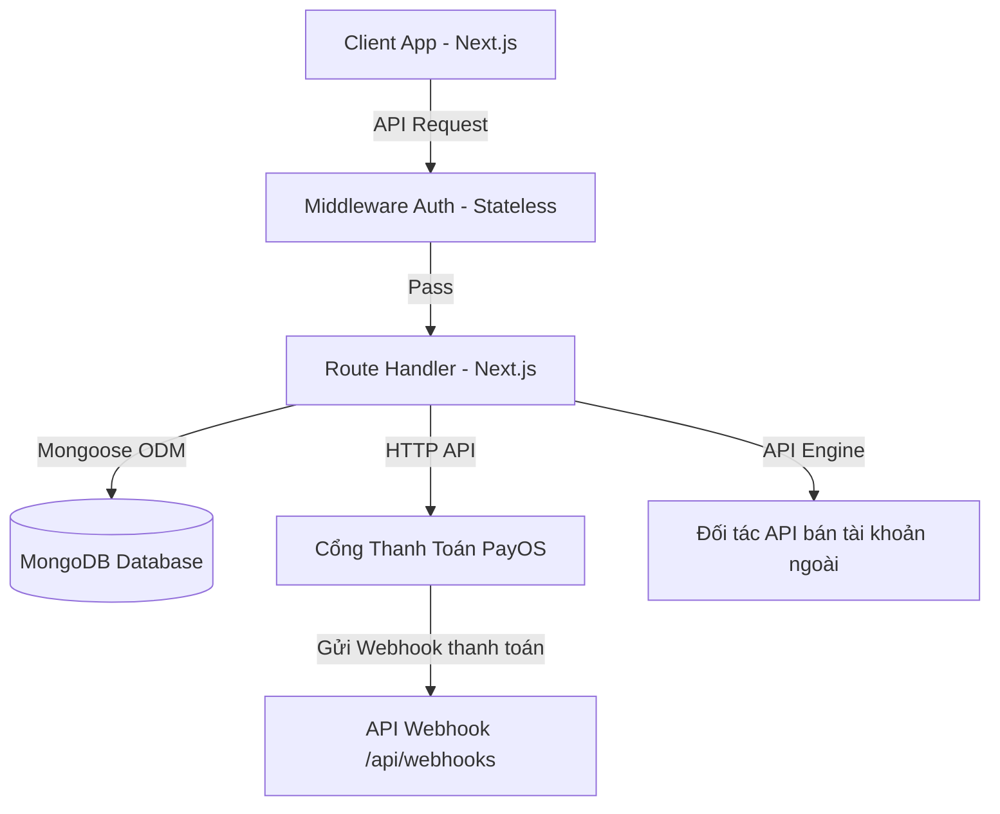

# TÀI LIỆU KỸ THUẬT CHI TIẾT HỆ THỐNG DỊCH VỤ TÀI KHOẢN ẢO
**Trạng thái:** Đã tối ưu bảo mật & kiến trúc giao dịch (Sẵn sàng Go-live)

Tài liệu này mô tả chi tiết kiến trúc, mô hình dữ liệu, các luồng giao dịch cốt lõi và hướng dẫn vận hành hệ thống MMO Shop.

---

## 1. Kiến Trúc Tổng Quan (System Architecture)

Hệ thống được thiết kế theo kiến trúc **Next.js App Router (Fullstack React/Node.js)** kết hợp với cơ sở dữ liệu phi quan hệ **MongoDB**.



### Các thành phần chính:
*   **Frontend (Client):** Sử dụng React Client Components với TailwindCSS v4 để tạo giao diện phản hồi nhanh (Responsive) và mượt mà.
*   **Stateless Middleware:** Thực hiện giải mã và verify chữ ký token JWT từ cookie/header của trình duyệt mà không kết nối cơ sở dữ liệu để đạt hiệu năng tối ưu.
*   **Generic API Engine:** Module tích hợp nhà cung cấp ngoài động. Đọc cấu hình kết nối từ DB để tự động gửi request mua và parse định dạng tài khoản theo cấu hình của từng nhà cung cấp.

---

## 2. Mô Hình Dữ Liệu Cốt Lõi (Database Models)

Hệ thống sử dụng **Mongoose ODM** để giao tiếp với MongoDB. Các Collection chính bao gồm:

### 2.1. User (`User`)
Lưu trữ thông tin người dùng, số dư ví và cấu hình khuyến mãi riêng biệt.
*   `email` (String, unique, index): Email đăng nhập.
*   `phone` (String, unique, index): Số điện thoại định dạng Việt Nam.
*   `fullName` (String): Họ và tên.
*   `password` (String): Mật khẩu đã được hash bằng `bcryptjs`.
*   `role` (enum: `customer`, `admin`, `seller`): Quyền truy cập.
*   `status` (enum: `active`, `blocked`, `pending`): Trạng thái hoạt động.
*   `balance` (Number): Số dư khả dụng hiện tại (VND).
*   `bonusPercentage` (Number): Tỷ lệ khuyến mãi nạp tiền riêng được Admin thiết lập cho user.
*   `totalSpent` (Number): Tổng số tiền đã chi tiêu (dùng để tính toán cấp độ VIP/bonus).

### 2.2. Invoice (`Invoice`)
Lưu trữ thông tin yêu cầu nạp tiền (PayOS hoặc thủ công).
*   `userId` (String, index): ID người dùng tạo yêu cầu.
*   `orderCode` (Number, unique, index): Mã giao dịch duy nhất (dùng để đối chiếu với PayOS và webhook).
*   `amount` (Number): Số tiền gốc cần thanh toán.
*   `bonus` (Number): Số tiền khuyến mãi được cộng thêm.
*   `totalAmount` (Number): Tổng số tiền thực nhận (`amount + bonus`).
*   `status` (enum: `pending`, `completed`, `failed`, `expired`): Trạng thái thanh toán.
*   `paymentMethod` (enum: `payos`, `manual`): Phương thức nạp.
*   `qrCode`, `checkoutUrl` (String): Thông tin link/mã QR thanh toán PayOS.
*   `expiresAt` (Date, TTL index): Hạn hóa đơn, tự động xóa khỏi DB sau 30 ngày.

### 2.3. Order (`Order`)
Lưu trữ thông tin đơn hàng mua tài khoản ảo của khách hàng.
*   `userId` (ObjectId, index): Người mua.
*   `productId` (ObjectId): Sản phẩm mua.
*   `quantity` (Number): Số lượng mua.
*   `totalPrice` (Number): Tổng số tiền đã trừ.
*   `status` (enum: `completed`, `failed`): Trạng thái đơn hàng.
*   `accounts` (Array): Mảng chứa danh sách thông tin tài khoản đã bàn giao (username, password, email, cookie, raw format...).
*   `source` (enum: `internal`, `external`): Hàng lấy từ kho local hay mua hộ từ đối tác ngoài.

### 2.4. Webhook (`Webhook`)
Lưu trữ lịch sử tất cả webhook gửi từ cổng thanh toán PayOS để đối chiếu và tránh xử lý trùng (Idempotency).
*   `code` (String): Mã trạng thái từ PayOS.
*   `success` (Boolean): Trạng thái giao dịch.
*   `data` (Object): Dữ liệu chi tiết giao dịch (số tài khoản gửi, tham chiếu ngân hàng, mã đơn hàng...).
*   `signature` (String): Chữ ký đi kèm webhook.
*   `isSignatureValid` (Boolean): Ghi nhận chữ ký có hợp lệ hay không.
*   `status` (enum: `pending`, `completed`, `expired`): Trạng thái xử lý của hệ thống đối với webhook.
*   `expiresAt` (Date, TTL index): Tự động xóa khỏi DB sau 24 giờ.

---

## 3. Các Luồng Giao Dịch Đã Được Bảo Mật & Tối Ưu

### 3.1. Luồng Nạp Tiền Thống Nhất & Xác Thực Webhook
Việc tạo hóa đơn và link thanh toán đã được đưa toàn bộ về xử lý tại Backend để tránh nguy cơ Client can thiệp sửa đổi số tiền khống.

```
[Client]                            [Server Backend]                          [PayOS API]
   |                                       |                                       |
   |-- 1. POST /user/balance/deposit ------>|                                       |
   |      { amount: 100000 }               |                                       |
   |                                       |-- 2. Sinh unique orderCode -----------|
   |                                       |-- 3. Tạo chữ ký bảo mật --------------|
   |                                       |-- 4. POST /payment-requests --------->|
   |                                       |<-- 5. Trả về qrCode & checkoutUrl ----|
   |                                       |                                       |
   |                                       |-- 6. Lưu Invoice (status: pending) ---|
   |<- 7. Trả về qrCode & checkoutUrl -----|                                       |
```

**Xác thực Webhook an toàn:**
Khi ngân hàng báo có tiền, PayOS gửi POST webhook tới `/api/webhooks`:
1.  **Bắt buộc xác minh chữ ký:** Server thực hiện hash `checksumKey` từ biến môi trường với các trường dữ liệu nhận được để đối chiếu chữ ký gốc. Nếu sai lệch chữ ký, hệ thống lập tức **từ chối (HTTP 400)**.
2.  **Đối chiếu chéo số tiền:** Tìm hóa đơn `Invoice` trong DB theo `orderCode` nhận từ webhook. Kiểm tra xem số tiền thực tế khách chuyển khoản (`webhookData.data.amount`) có **khớp hoàn toàn** với số tiền trong hóa đơn (`invoice.amount`) hay không. Nếu không khớp, từ chối giao dịch để ngăn chặn gian lận nạp tiền khống.
3.  **Cộng số dư an toàn:** Nếu hợp lệ, chuyển đổi trạng thái hóa đơn sang `completed` và cộng số tiền `invoice.totalAmount` (đã bao gồm khuyến mãi tính toán trên backend) vào ví của người dùng.

---

### 3.2. Luồng Mua Hàng Ngoài Chống Race Condition (Atomic Reserve & Refund)
Để đảm bảo Admin không bị đối tác ngoài trừ tiền oan khi tài khoản của khách hàng không đủ để trừ tiền (do spam click hoặc race condition), hệ thống áp dụng luồng **Trừ trước - Hoàn sau**:

```
[Khách hàng]                       [Server Backend]                     [API Nhà cung cấp]
     |                                    |                                      |
     |-- 1. Gửi yêu cầu mua tài khoản --->|                                      |
     |                                    |-- 2. Tạm trừ số dư ví của khách -----|
     |                                    |      (Atomic update balance >= price)|
     |                                    |                                      |
     |                                    |-- 3. Gọi API mua tài khoản --------->|
     |                                    |                                      |
     |                                    |   Trường hợp A: API ngoài THÀNH CÔNG |
     |                                    |<-- 4a. Nhận danh sách tài khoản -----|
     |                                    |-- 5a. Tạo đơn hàng completed --------|
     |<-- 6a. Bàn giao tài khoản ---------|                                      |
     |                                    |                                      |
     |                                    |   Trường hợp B: API ngoài THẤT BẠI   |
     |                                    |<-- 4b. Báo lỗi API / Timeout --------|
     |                                    |-- 5b. Hoàn trả tiền vào ví khách ----|
     |<-- 6b. Báo lỗi mua hàng thất bại --|                                      |
```

---

## 4. Hướng Dẫn Cấu Hình Môi Trường Chuẩn Production (Go-live)

Để triển khai hệ thống hoạt động ổn định trên môi trường Production, hãy thiết lập các biến môi trường sau trong file `.env` hoặc cấu hình Host:

```env
# ─── DATABASE CONFIGURATION ──────────────────────────────────────────
MONGODB_URI=mongodb+srv://<username>:<password>@<cluster>.mongodb.net/your-db?retryWrites=true&w=majority

# ─── JWT CONFIGURATION ───────────────────────────────────────────────
# Bắt buộc phải thay đổi secret key mạnh ở môi trường production
JWT_SECRET=your-super-strong-jwt-secret-key-for-production

# ─── CỔNG THANH TOÁN PAYOS CONFIGURATION ─────────────────────────────
# Lấy từ trang quản trị merchant của PayOS (https://my.payos.vn)
PAYOS_CLIENT_ID=your-payos-client-id
PAYOS_API_KEY=your-payos-api-key
PAYOS_CHECKSUM_KEY=your-payos-checksum-key

# ─── EMAIL NOTIFICATION (RESEND) CONFIGURATION ───────────────────────
# Dùng để gửi email thông báo nạp tiền thủ công cho admin
RESEND_API_KEY=re_your-resend-api-key
EMAIL_NAME="MMO Shop Auto Notification"
EMAIL_VERIFIED_SENDER=noreply@yourdomain.com

# ─── APP BASE URL ───────────────────────────────────────────────────
NEXT_PUBLIC_APP_URL=https://tainguyen247.io.vn
```

### Các lưu ý vận hành:
1.  **Hosting:** Khuyên dùng triển khai Next.js bằng hình thức build Docker Container hoặc chạy PM2 Node.js trực tiếp trên VPS thay vì deploy Serverless (như Vercel) để đảm bảo:
    *   Hỗ trợ kết nối SSE ổn định cho việc theo dõi trạng thái thanh toán thời gian thực (nếu dùng lại).
    *   Giữ kết nối Database ổn định không bị tràn connection pool.
    *   Cho phép in-memory cache hoạt động đúng nghĩa (nếu không tích hợp Redis ngoài).
2.  **MongoDB:** Nên bật cơ chế Replica Set cho MongoDB để hỗ trợ transactions nếu hệ thống phát triển quy mô lớn.
3.  **Cron Job dọn dẹp:** Thiết lập Cron Job định kỳ gọi tới `POST /api/webhooks/cleanup` với header `Authorization: Bearer $CRON_SECRET` để tự động dọn dẹp các webhook cũ đã quá hạn 24 giờ.
